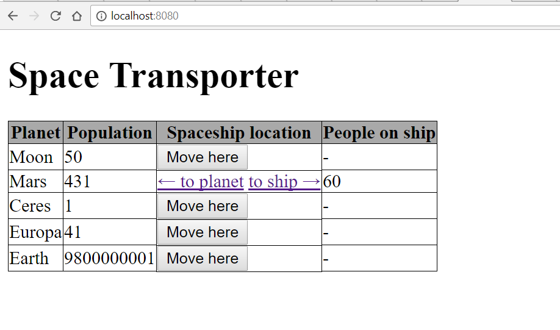
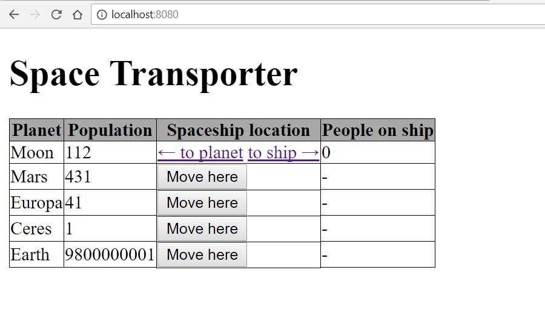

# 21stCenturyFoxOSIC Orientation Normal Exam

## Getting Started

- **Fork** this repository under your own account
- Clone the forked repository under your account to your computer
- Create a `.gitignore` file so generated files won't be committed
- Commit your progress frequently and with descriptive commit messages
- All your answers and solutions should go in this repository

## Keep in mind

- You can use any resource online, but **please work individually**

- **Don't just copy-paste** your answers and solutions, use your own words
  instead

- **Don't push your work** to GitHub until your mentor announces that the time
  is up

- Before diving to coding **think about the structure**

## Tasks

# Space Transporter

Let's imagine that it's 2050 and we are able to travel through space.
Build a cool application that will be able to transport people anywhere in the
endless space. 

## Frontend



- the **frontend** should have

  - a heading with the title of the site
  - table as depicted above
  - buttons to move the spaceship to any planet
  - arrows to move the people from planet to ship and vice versa
  - consider using some special html characters for the arrows
  
## Database

You can use provided SQL file to fill the database:

- [for MySQL](assets/backend-space-transporter.sql)
- or [for MSSQL](assets/backend-space-transporter-ms.sql).

or just execute few commands and fill it with your own data.

## Backend

- there should be only one spaceship and more planets
- for better understanding take a look at endpoints, which are described [here](#endpoints)

- when **Move here** button is submitted the backend should

  - set the spaceship location so that it will move to the planet of the same row where
    it was clicked

  - spaceship can be only at one planet at a time

  - save the changes to the database
  
- the max capacity of the spaceship is 60 currently

  - it can *NOT* transport more people then this number
  - and it can *NOT* hold more people in the spaceship than the max capacity

- when **to planet** is clicked the backend should

  - increase the population of the planet by the number of people on the ship. Don't forget about decreasing the
    number of people on the spaceship with the same amount. It can't go under 0. 

  - save the changes to the database

- when **to ship** is clicked the backend should

  - increase the number of people on the ship by the amount of people moved from planet. Don't forget about maximum capacity of ship. Also don't forget about decreasing the
    population on the planet with the same amount. It can't go under 0. 

  - save the changes to the database


## Endpoints

- You should follow the endpoints description and use required methods

### GET `/`

- the endpoint should render an HTML displaying the main page

### POST `/movehere/{id}`

- this endpoint should be responsible for moving the ship around

- you should check if the new destination (`planet`) is equal to the current position (current `planet` of the spaceship).
If it is equal then it should redirect to the main page. In this case the main page should display a descriptive error message.

- set the new planet of the spaceship

- save changes

- redirect to the main page


### GET `/toship/{id}`

- this endpoint should move the people to the ship

  - the max capacity of people can be moved on one click

  - if there is less people on the planet than the max capacity of the ship,
    move everybody to the ship

  - if there is less people on the spaceship than the max capacity, then only
    remove people from the planet that fills up 
    the spaceship to the full capacity

- save changes

- redirect to the main page

### GET `/toplanet/{id}`

- this endpoint should move the people to the planet

  - only all passengers can be moved on to the planet, no more,
    no less

- save changes

- redirect to the main page



## Question

Given the following table named `carsForSale`

| carForSaleID | manufacturerName | modelName | acquisitionPrice | dateAcquired |
|:------------:|:----------------:|:---------:|:----------------:|:------------:|
|      1       |    Volkswagen    |   Jetta   |      13300       |  2007-01-07  |
|      2       |     Renault      |  Laguna   |      14700       |  2007-02-12  |
|      3       |       Ford       |   Focus   |      13600       |  2007-03-09  |
|      4       |      Daewoo      |   Tico    |       1100       |  2007-04-17  |
|      5       |      Toyota      |  Avensis  |      14500       |  2007-05-04  |
|      6       |    Alfa Romeo    |    156    |       8700       |  2007-06-23  |
|      7       |    Volkswagen    |  Passat   |      22000       |  2007-07-16  |
|      8       |     Renault      |   Clio    |       6400       |  2007-08-22  |
|      9       |       Ford       |  Fiesta   |       6900       |  2007-09-11  |
|      10      |      Daewoo      |   Cielo   |       3600       |  2007-10-18  |
|      11      |      Toyota      |   Rav4    |      24900       |  2007-11-11  |
|      12      |    Alfa Romeo    |    147    |       7500       |  2007-12-25  |
|      13      |    Volkswaen     |   Golf    |      16700       |  2008-01-14  |
|      14      |     Renault      |  Megane   |      11400       |  2008-02-24  |
|      15      |       Ford       |  Mondeo   |      14600       |  2008-03-18  |
|      16      |      Daewoo      |   Matiz   |       1700       |  2008-04-08  |
|      17      |      Toyota      |   Yaris   |       7400       |  2008-05-02  |
|      18      |    Alfa Romeo    |    159    |      17000       |  2008-06-12  |
|      19      |    Volkswagen    |   Polo    |       6500       |  2008-07-30  |
|      20      |     Renault      |  Scenic   |       6800       |  2008-08-11  |
|      21      |       Ford       |  Escort   |       2000       |  2008-09-22  |
|      22      |      Daewoo      |  Espero   |       2500       |  2008-10-09  |
|      23      |      Toyota      |  Corolla  |      103000      |  2008-11-05  |
|      24      |    Alfa Romeo    |    166    |       5200       |  2008-12-24  |

- Write an SQL query to get all `Renault` cars which are more expensive than
  8000

- Write an SQL query to decrease all `Volkswagen` car's price by 100 units

```
SELECT * FROM carsForSale WHERE manufacturernNme = 'Renault' AND acquisitionPrice > 8000;
UPDATE carsForSale WHERE manufacturerName = 'Volkswagen' SET acquisitionPrice = acquisitionPrice - 100;

```
