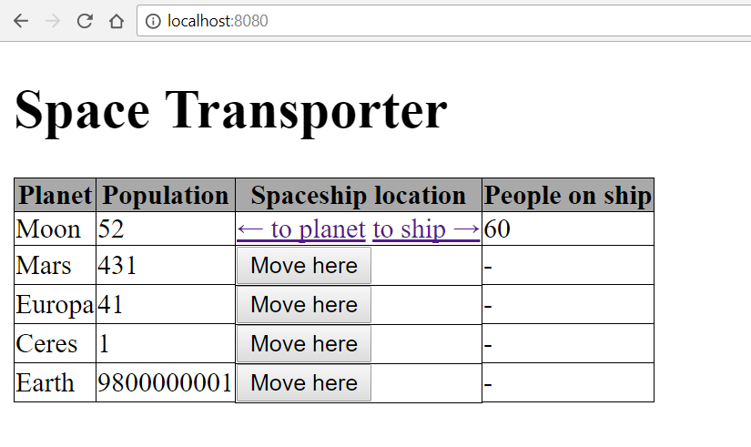

# Space Transporter

Let's imagine that it's 2050 and we are able to travel through space.
Build a cool application that will be able to transport people anywhere in the
endless space. 

## Backend

- there should be only one spaceship and more planets
- for better understanding take a look at endpoints, which are described [here](#endpoints)

- when **Move here** button is submitted the backend should

  - set the spaceship location so that it will move to the planet of the same row where
    it was clicked

  - spaceship can be only at one planet at a time

  - save the changes to the database
  
- the max capacity of the spaceship is 60 currently

  - it can *NOT* transport more people then this number
  - and it can *NOT* hold more people in the spaceship than the max capacity

- when **to planet** is clicked the backend should

  - increase the population of the planet by the number of people on the ship. Don't forget about decreasing the
    number of people on the spaceship with the same amount. It can't go under 0. 

  - save the changes to the database

- when **to ship** is clicked the backend should

  - increase the number of people on the ship by the amount of people moved from planet. Don't forget about maximum capacity of ship. Also don't forget about decreasing the
    population on the planet with the same amount. It can't go under 0. 

  - save the changes to the database

## Endpoints

- You should follow the endpoints description and use required methods

### GET `/`

- the endpoint should render an HTML displaying the main page

### POST `/movehere/{id}`

- this endpoint should be responsible for moving the ship around

- you should check if the new destination (`planet`) is equal to the current position (current `planet` of the spaceship).
If it is equal then it should redirect to the main page. In this case the main page should display a descriptive error message.

- set the new planet of the spaceship

- save changes

- redirect to the main page

### GET `/toship/{id}`

- this endpoint should move the people to the ship

  - the max capacity of people can be moved on one click

  - if there is less people on the planet than the max capacity of the ship,
    move everybody to the ship

  - if there is less people on the spaceship than the max capacity, then only
    remove people from the planet that fills up 
    the spaceship to the full capacity

- save changes

- redirect to the main page

### GET `/toplanet/{id}`

- this endpoint should move the people to the planet

  - only all passengers can be moved on to the planet, no more,
    no less

- save changes

- redirect to the main page

